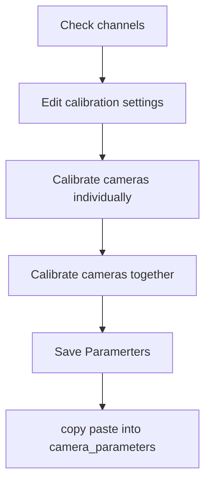

# FlowChart

## Calibration

```mermaid
flowchart TD;
  A[Check channels] --> B[Edit calibration settings];
  B[Edit calibration settings] --> C[Calibrate cameras individually];
  C[Calibrate cameras individually] --> D[Calibrate cameras together];
  D[Calibrate cameras together] --> E[Save Parameters];
  E[Save Paramerters] --> F[copy paste into camera_parameters];
```
