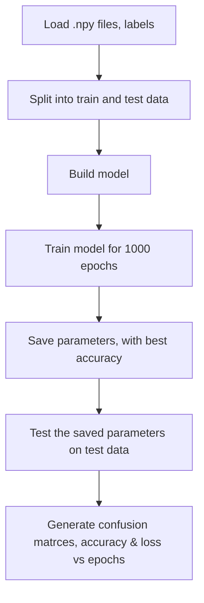

# FlowChart

## Classifier

```mermaid
flowchart TD;
  A[Load .npy files, labels] --> B[Split into train and test data];
  B[Split into train and test data] --> C[Build model];
  C[Build model] --> D[Train model for 1000 epochs];
  D[Train model for 1000 epochs] --> E[Save parameters, with best accuracy];
  E[Save parameters, with best accuracy] --> F[Test the saved parameters on test data];
  F[Test the saved parameters on test data] --> G[Generate confusion matrces, accuracy & loss vs epochs];
```
