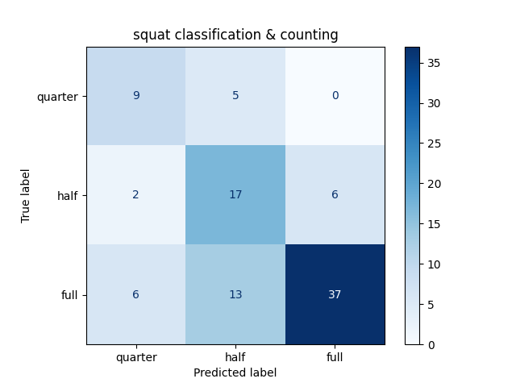
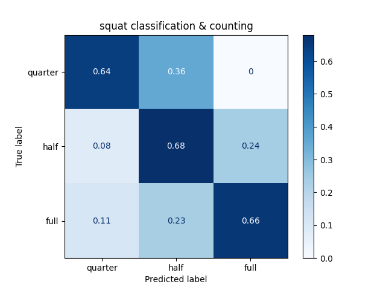

# README Original

## SquatClassificationAndCounting

https://github.com/leoxiaobin/deep-high-resolution-net.pytorch.git 을 활용함.
스쿼트 종류 판별 및 횟수 카운트 프로그램.

## Translated

https://github.com/leoxiaobin/deep-high-resolution-net.pytorch.git utilized. Squat type determination and rep counting program.

#### Make sure you clone the above repository and save it properly. This code utilizes the above repository as a base for pose estimation.

The code will be eventually edited to stop utilizing flask and mysql

Currently the code uses flask with a few korean translations, and mysql with the following databases. 

### Databases

To build your database on mysql, copy and paste the following commands in mysql:

```
CREATE DATABASE squatdb;
USE squatdb;
CREATE TABLE membertbl(userNo INT AUTO_INCREMENT, userName VARCHAR(255) NOT NULL, userEmail VARCHAR(255) NOT NULL, userPwd VARCHAR(255) NOT NULL, PRIMARY KEY(userNo));
CREATE TABLE squattbl(num INT AUTO_INCREMENT, userNo INT NOT NULL, datetime DATETIME NOT NULL, quarter INT NOT NULL, half INT NOT NULL, full INT NOT NULL, total INT NOT NULL, PRIMARY KEY(num), FOREIGN KEY(userNo) REFERENCES membertbl(userNo));
CREATE TABLE challengetbl(userNo INT NOT NULL, startdate DATE NOT NULL, finishdate DATE NOT NULL, count INT NOT NULL, FOREIGN KEY(userNo) REFERENCES membertbl(userno));
SHOW TABLES;
SHOW COLUMNS FROM membertbl;
SHOW COLUMNS FROM squattbl;
SHOW COLUMNS FROM challengetbl;
```
### Templates

The edited nd translated templates are under/edited/templates. These are used for the flask implementation of the code. Make sure you unzip templates.zip and static.zip and keep it in the same folder as the main code.

# README new

## sequential_reqader.py

This code uses the preexisting code and takes multiple videos to count squats.

A few edits have been made to the main code, this allows us to bypass Flask and MySQL to analyze the code.

To run this program, first get a csv input file, saved as input_csv.csv in the same folder as the code. Then run:

```
python sequential_reader.py
```

in your terminal. This should run the program fro multiple videos while extracting pose data and creating a csv file with all the input videos and the types of squats they did. 

## Results

### Confusion Matrices

Confusion matrix without normalization



Confusion matrix with normalization



### Inferences

As seen, the algorthim is quite accurate. It does not tend to misclassify squats. The pose estimation based on coco is sufficient to help classify the squat. 


