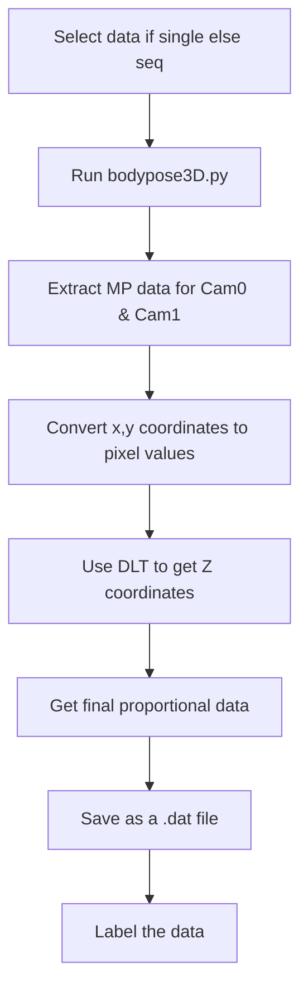

# FlowChart

## Conversion to pose data

```mermaid
flowchart TD;
  A[Select data if single else seq] --> B[Run bodypose3D.py];
  B[Run bodypose3D.py] --> C[Extract MP data for Cam0 & Cam1];
  C[Extract MP data for Cam0 & Cam1] --> D[Convert x,y coordinates to pixel values];
  D[Convert x,y coordinates to pixel values] --> E[Use DLT to get Z coordinates];
  E[Use DLT to get Z coordinates] --> F[Get final proportional data];
  F[Get final proportional data] --> G[Save as a .dat file];
  G[Save as a .dat file] --> H[Label the data];
```
