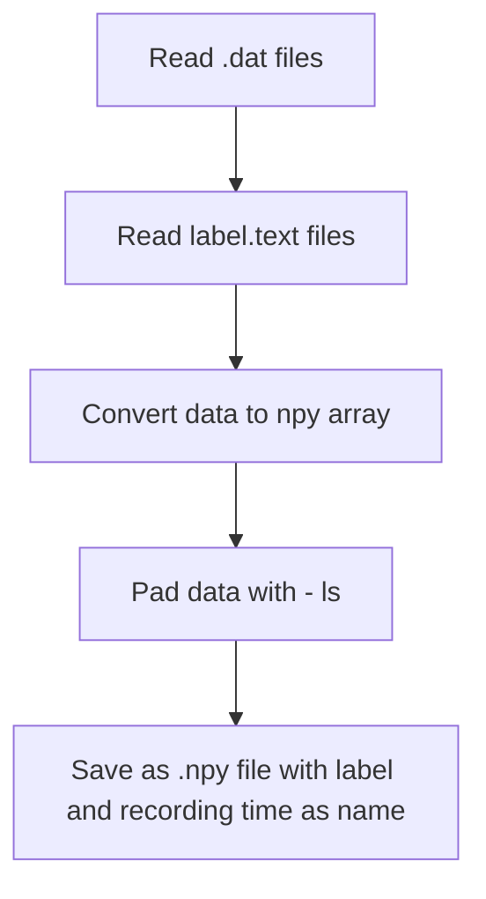

# FlowChart

## Data collection / Converion

```mermaid
flowchart TD;
  A[Read .dat files] --> B[Read label.text files];
  B[Read label.text files] --> C[Convert data to npy array];
  C[Convert data to npy array] --> D[Pad data with -1sec];
  D[Pad data with - ls] --> E[Save as .npy file with label and recording time as name];
```
  
