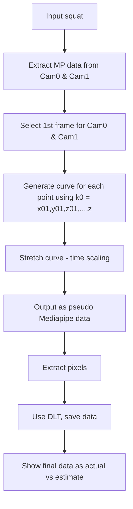

# FlowChart

## Estimate Squat

```mermaid
flowchart TD;
  A[Input squat] --> B[Extract MP data from Cam0 & Cam1];
  B[Extract MP data from Cam0 & Cam1] --> C[Select 1st frame for Cam0 & Cam1];
  C[Select 1st frame for Cam0 & Cam1] --> D[Generate curve for each point using k0 = x01,y01,z01,....z];
  D[Generate curve for each point using k0 = x01,y01,z01,....z] --> E[Stretch curve - time scaling];
  E[Stretch curve - time scaling] --> F[Output as pseudo Mediapipe data];
  F[Output as pseudo Mediapipe data] --> G[Extract pixels];
  G[Extract pixels] --> H[Use DLT, save data];
  H[Use DLT, save data] --> I[Show final data as actual vs estimate];
```
  
