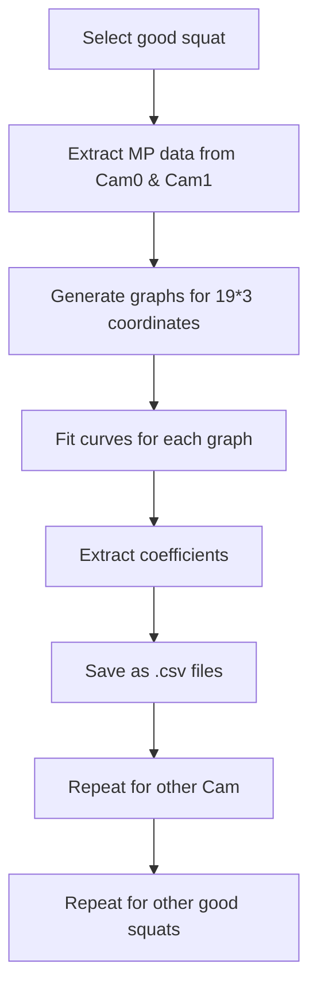

# FlowChart

## Fit Curves

```mermaid
flowchart TD;
  A[Select good squat] --> B[Extract MP data from Cam0 & Cam1];
  B[Extract MP data from Cam0 & Cam1] --> C[Generate graphs for 19*3 coordinates];
  C[Generate graphs for 19*3 coordinates] --> D[Fit curves for each graph];
  D[Fit curves for each graph] --> E[Extract coefficients];
  E[Extract coefficients] --> F[Save as .csv files];
  F[Save as .csv files] --> G[Repeat for other Cam];
  G[Repeat for other Cam] --> H[Repeat for other good squats];
```
