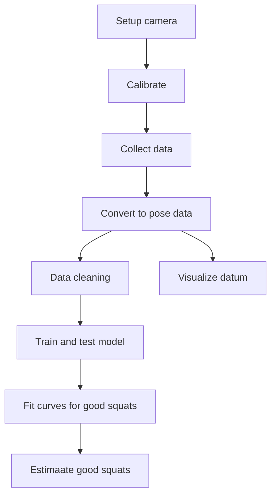

## Flow Chart

## Setup camera

```mermaid
flowchart TD;
 A[Setup camera] --> B[Calibrate];
 B[Calibrate] --> C[Collect data];
 C[Collect data] --> D[Convert to pose data];
 D[Convert to pose data] --> E[Data cleaning];
 D[Convert to pose data] --> E1[Visualize datum];
 E[Data cleaning] --> F[Train and test model];
 F[Train and test model] --> G[Fit curves for good squats];
 G[Fit curves for good squats] --> H[Estimaate good squats];
```
