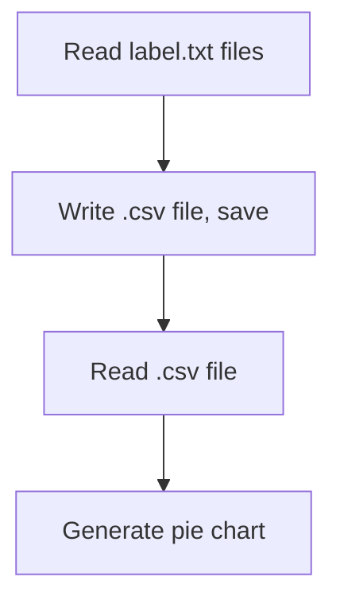
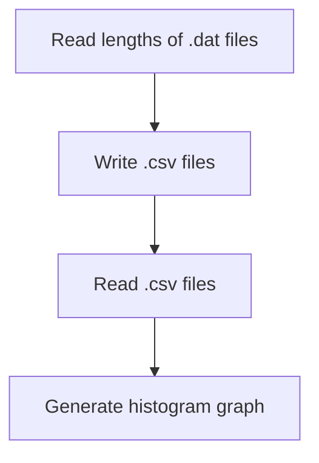

# FlowChart

## Visualization

     (A) Labels

```mermaid
flowchart TD;
  A[Read label.txt files] --> B[Write .csv file, save];
  B[Write .csv file, save] --> C[Read .csv file];
  C[Read .csv file] --> D[Generate pie chart];
```

    (B) Lengths 

```mermaid
flowchart TD;
  A[Read lengths of .dat files] --> B[Write .csv files];
  B[Write .csv files] --> C[Read .csv files];
  C[Read .csv files] --> D[Generate histogram graph];
```
